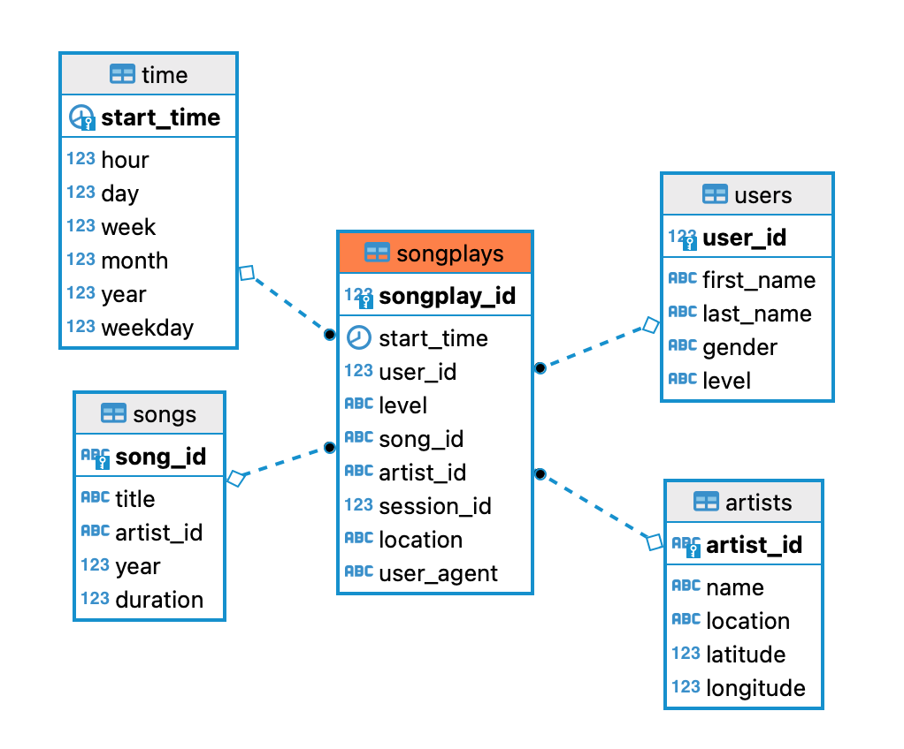

# Sparkify Postgres

- [About](#about)
- [Database Design](#database-design)
- [ETL Pipeline Design](#etl-pipeline-design)
- [Getting Started](#getting-started)
- [Directory Strucure](#directory-structure)
- [References](#references)

## About

A startup called Sparkify wants to analyze the data they've been collecting on songs and user activity on their new music streaming app. Currently there is no easy way for Sparkify's analytics team to query their data to better understand their user's listening behaviour. In order to help out Sparkify's analytics team, we'll create an ETL (Extract, Transform and Load) Pipeline to extract user activity and song data from JSON files and ingest the data into a Postgres Database.  

## Database Design

### Data

The data consists of JSON logs on user activity (**log_data**) and song meta data (**song_data**)

### Database Schema

Using the song and log datasets, we'll create a star schema optimized for queries on song play analysis. This includes the following tables:


- Fact table: **songplays**.
- Dimension tables: **songs**, **artists**, **users**, **time**. 



## ETL Pipeline Design

The ETL pipline comprises the following components:

- ETL of song data into songs table from song_data JSON files.
- ETL of artist data into artists table from song_data JSON files.
- ETL of time data into time table from log_data JSON files.
- ETL of user data into users table from log_data JSON files.
- ETL of songplay data into songplays table from log_data JSON files.

## Getting Started

### Tech Stack

- Docker
- Jupyter Notebook
- Postgres

### Build the containers

Ensure docker is installed.

```cmd

docker compose build

```

### Start the containers

```cmd

docker compose up

```

Docker compose will spin up two containers:

- sparkifydb (a postgres database)
- jupyter (jupyter notebook container)

### Create the Database Schema

Run create_tables.py:

```cmd

docker compose run --rm jupyter_notebook python src/scripts/create_tables.py

```

### Extract, Transfer and Load the data into the Database

Run etl.py:

```cmd

docker compose run --rm jupyter_notebook python src/scripts/etl.py

```

## Directory Structure

- The Raw data of the Project can be found in **workspace/data** folder.
- **workspace/create_table.py**
  - Creates the sparkify database (drops the previous if one exists already).
  - Drops all existing tables.
  - Creates all tables.
  - Closes the connection.
- **workspace/sql_queries.py**
  - Drop table sql statement
  - Create table DDL for all tables
  - Insert sql statements for all tables
  - Select statement for ETL pipline
  - Query lists (Lists of Drop, Create, Insert statements)
- **workspace/etl.ipynb** is a helper tool for the desgin & development of the prototype of the ETL pipline.
- **workspace/test.ipynb** is a helper tool to quickly check all tables.
- **worksapce/etl.py** final ETL pipline of the project.
- **workspace/Sample.ipynb** helper tool to get quickly experiment.
- **README.md** documentation of the project.
- **requirements.txt** packages installed in jupyter_notebook container
- **docker-compose.yml** docker-compose file defining the services
- **compose/jupyter-notebook/Dockerfile** Dockerfile for jupyter_notebook
- **compose/postgres/Dockerfile** Dockerfile for postgres
- **.envs/.postgres** Environment file containing user, password etc. !! Do not share this in your repository !!
- **.gitignore** Python gitignore provided by GitHub

## References

This project is part of the [Udacity Data Engineering nanodegree](https://www.udacity.com/course/data-engineer-nanodegree--nd027).

- [Docker documentation](https://docs.docker.com/)
- [Jupyter Docker Stacks](https://jupyter-docker-stacks.readthedocs.io/en/latest/using/recipes.html)
- [Markdown guide](https://www.markdownguide.org/basic-syntax/)
- [Poetry documentation](https://python-poetry.org/docs/)
